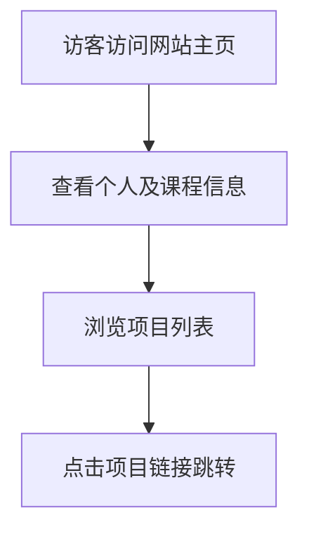

## 1. 产品概述
这是一个为课程“IXP2”设计的单页项目索引网站（Projects Index Page）。
- 主要用于展示并链接学生（Quanyi Li）在 2026 年春季学期完成的 5 个课程项目。
- 采用极简、高级的黑色系设计，整体风格类似于时尚杂志或高端作品集网站（portfolio / editorial / fashion website），旨在以优雅的设计感呈现学术成果。

## 2. 核心功能

### 2.1 用户角色
本网站为纯展示型单页，无用户注册和角色区分。
| 角色 | 注册方式 | 核心权限 |
|------|----------|----------|
| 访客 | 无 | 浏览页面信息并点击跳转项目链接 |

### 2.2 功能模块
1. **作品集主页**：个人信息展示、课程信息展示、项目链接列表。

### 2.3 页面详情
| 页面名称 | 模块名称 | 功能描述 |
|----------|----------|----------|
| 作品集主页 | 头部信息区 | 显示姓名（Quanyi Li）、课程名（IXP2）、学期（Spring 2026） |
| 作品集主页 | 项目列表区 | 垂直或网格排列展示 5 个项目链接（Project 1 至 Final Project），支持高级悬停动效 |

## 3. 核心流程
访客进入页面 -> 浏览头部信息（了解作者及课程背景） -> 浏览项目列表 -> 鼠标悬停项目链接查看动效 -> 点击链接跳转至具体项目页面。

## 4. 用户界面设计
### 4.1 设计风格
- **主色调**：深邃的纯黑色或极暗灰（如 `#050505` 或 `#000000`）。
- **辅色调**：高级的灰白色或米白色文本（如 `#EAEAEA` 或 `#F5F5F0`），以及细微的边框或分隔线。
- **字体**：衬线体（Serif）与无衬线体（Sans-serif）的优雅结合。例如标题使用极具时尚感和编辑风格的衬线体（如 `Playfair Display`, `Cormorant Garamond` 或 `Bodoni Moda`），正文或辅助信息使用干净的无衬线体（如 `Inter`, `Helvetica Neue` 或 `Neue Montreal`）。
- **布局风格**：极简主义（Minimalist），大量的留白（负空间），不对称排版或严谨的网格排版（Editorial/Fashion website style）。
- **动效**：细腻的 CSS 悬停效果，如文字透明度变化、细线延伸、斜体变换或轻微的位移，页面加载时可能有轻微的淡入和向上滑动的优雅动效，避免过度夸张的动画。

### 4.2 页面设计概览
| 页面名称 | 模块名称 | UI 元素 |
|----------|----------|---------|
| 作品集主页 | 头部信息 | 大号的衬线体姓名标题，配合小号的无衬线体课程及学期信息，排版具有呼吸感。 |
| 作品集主页 | 项目列表 | 极简的文字列表，配合精细的下划线或序号。悬停时文字可能变色或显示箭头图标，字体可能会有衬线到斜体（Italic）的优雅转换。 |

### 4.3 响应式设计
采用桌面端优先（Desktop-first）设计，同时完美适配移动端（单列流式布局），确保在手机上依然保持高级感和可读性。
