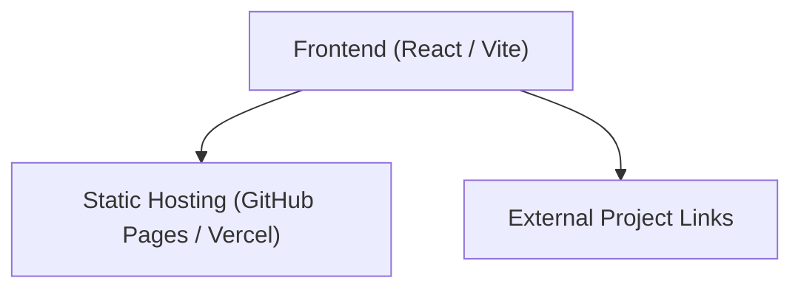

## 1. 架构设计


## 2. 技术说明
- 前端框架：React@18 + tailwindcss@3 + vite
- 动画库：framer-motion (用于高级页面入场动画及复杂的悬停互动)
- 初始化工具：vite-init
- 样式方案：Tailwind CSS 结合自定义 CSS 变量以实现高级定制化排版及排版级别的字体设计（Typography）。

## 3. 路由定义
| 路由 | 用途 |
|------|------|
| / | 单页主入口，展示姓名、课程信息及项目列表 |

## 4. API 定义
无后端 API，纯静态展示页面。

## 5. 服务器架构图
无。

## 6. 数据模型
数据为硬编码的静态数据，包含 5 个项目的标题和链接：

```json
[
  { "title": "Project 1", "url": "https://qli14-dev.github.io/project1/" },
  { "title": "Project 2", "url": "https://qli14-dev.github.io/css-2/" },
  { "title": "Project 3", "url": "https://qli14-dev.github.io/ixp2project3/" },
  { "title": "Project 4", "url": "https://qli14-dev.github.io/0331/" },
  { "title": "Final Project", "url": "https://qli14-dev.github.io/ixp-final-project/" }
]
```
